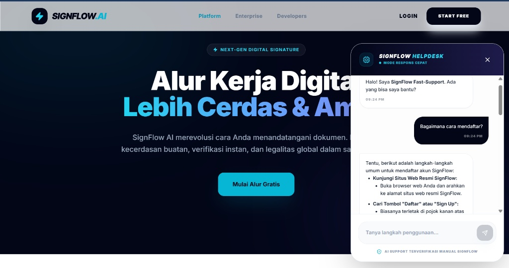

# SignFlow Chatbot -Helpdesk AI 🤖✍️

SignFlow Chatbot adalah asisten virtual cerdas berbasis AI yang dirancang untuk menangani pertanyaan dukungan pelanggan (Helpdesk) untuk layanan (Penyedia Sertifikat Elektronik & Tanda Tangan Digital). Aplikasi ini dibangun menggunakan Node.js, Express, dan ditenagai oleh model Google Gemini AI terbaru.

## 📸 Tampilan Chatbot



## ✨ Fitur Utama

* **Respons Otomatis & Akurat:** Menjawab pertanyaan seputar pendaftaran SignFlow, jenis akun, harga, dan tata cara tanda tangan (Single, Parallel, Hierarchy).
* **Format Markdown:** Memberikan jawaban dalam bentuk poin-poin yang rapi dan mudah dibaca oleh pengguna.
* **Integrasi Gemini AI:** Menggunakan SDK `@google/genai` terbaru untuk pemrosesan bahasa alami yang cepat dan kontekstual.
* **RESTful API:** Endpoint backend yang mudah dihubungkan dengan *frontend* web atau aplikasi mobile.

## 🛠️ Teknologi yang Digunakan

* **Backend:** Node.js, Express.js
* **AI Engine:** Google Gemini (`gemini-2.5-flash` / `gemini-1.5-flash`)
* **Library:** `@google/genai`, `dotenv`, `cors`, `express.json`

## 🚀 Panduan Instalasi (Lokal)

Ikuti langkah-langkah berikut untuk menjalankan aplikasi ini di komputer Anda:

1. **Clone Repositori**
   ```bash
   git clone [https://github.com/keane13/SignFlow_chatbot.git](https://github.com/keane13/SignFlow_chatbot.git)
   cd SignFlow_chatbot
